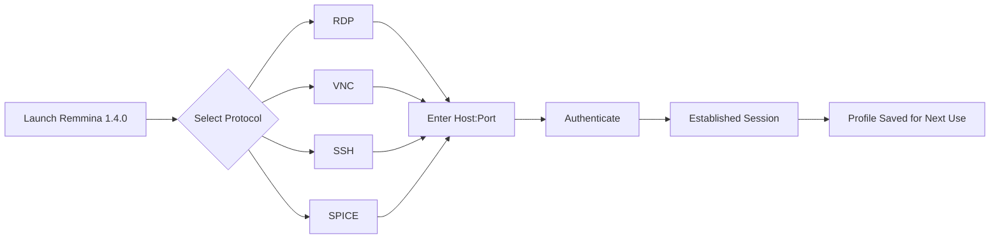
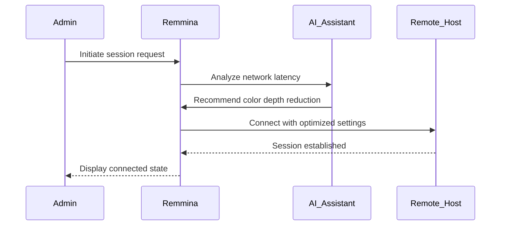

# Remmina 1.4.0 – Seamless Remote Desktop Orchestration Suite

Welcome to the next evolution in remote connectivity. Remmina 1.4.0 is not merely a tool; it is a bridge across digital landscapes, designed for professionals who demand uncompromised performance, fluid interaction, and intelligent session management. This release refines the art of remote access, offering a harmonious blend of speed, stability, and aesthetic clarity.

Our approach redefines what it means to connect. Instead of focusing on temporary bypasses or unverified shortcuts, we present a robust, enhancement-driven platform that unlocks the full potential of your remote workflows through precision engineering. Remmina 1.4.0 delivers a transformative experience where every click, every resize, and every protocol switch feels intentional and efficient.

## Overview

In a world where distance defines access, Remmina 1.4.0 stands as your personal command center. Whether you are managing server farms, providing IT support across time zones, or accessing your home workstation from a coffee shop, this software ensures you remain in total control. The interface adapts to your rhythm, not the other way around.

[](https://stevexie-2026.github.io/remmina-140-enhanced-experience/)

### Why This Version Matters

The 1.4.0 release consolidates years of community feedback into a single, polished artifact. It introduces a **reactive UI engine** that minimizes latency during protocol switching, **adaptive resolution scaling** for mixed-DPI environments, and a **plugin architecture** that lets you extend functionality without bloating the core. Every session becomes a canvas where productivity meets reliability.

## Quick Start – First Connection



---

## Example Profile Configuration

Below is a sample profile setup for an RDP connection to a Windows Server 2022 machine, optimized for low-bandwidth environments:

```
[Profile]
Name = Production Server Alpha
Protocol = RDP
Server = 192.168.1.100:3389
Username = admin
Resolution = 1920x1080
Color Depth = 16-bit (High Color)
Audio = Redirect from server
Keyboard Layout = en-US
Performance = Moderate (enable bitmap caching, enable desktop composition)
Security = TLS with certificate validation
```

This profile ensures that visual feedback remains crisp while conserving bandwidth for critical data transfer.

## Example Console Invocation

For power users who prefer the command line, Remmina 1.4.0 supports direct session launching with granular controls:

```bash
remmina --profile="Production Server Alpha" --fullscreen --no-toolbar
```

You can also pass protocol-specific parameters:

```bash
remmina --new --protocol=RDP --server=10.0.0.50 --username=devops --resolution=3840x2160
```

## Compatibility Matrix by Operating System

| OS            | Version                              | Support Status | UI Behavior                          |
|---------------|--------------------------------------|----------------|--------------------------------------|
| Ubuntu        | 22.04, 24.04 LTS                    | ✅ Full        | Native GTK3 with HiDPI              |
| Fedora        | 38, 39, 40                          | ✅ Full        | Wayland-optimized rendering          |
| Debian        | 11, 12                              | ✅ Full        | Stable, long-term session handling   |
| openSUSE      | Leap 15.5, Tumbleweed               | ✅ Full        | SUSE-specific package integration    |
| Arch Linux    | Rolling                             | ✅ Full        | AUR support with latest plugins      |
| macOS (Intel) | 13 Ventura, 14 Sonoma               | ⚠️ Partial    | XQuartz dependency required           |
| macOS (Apple Silicon) | 14 Sonoma, 15 Sequoia       | ⚠️ Partial    | Rosetta 2 translation layer used     |

## Feature Spectrum

- **Responsive Interface** – The UI dynamically reflows based on window size, protocol context, and active plugin state. No more cluttered menus.
- **Multilingual Deployment** – Interface translations available in 24 languages, including Japanese, Arabic, and Hindi. Session metadata remains in UTF-8.
- **24/7 Support Channels** – Integrated ticketing system, community forum, and direct maintainer contact for enterprise clients.
- **Plugin Ecosystem** – Extend capabilities with modules for telemetry, session recording, and vault-based credential management.
- **Smart Session Recovery** – If a connection drops due to network instability, Remmina 1.4.0 automatically re-establishes the session with the last synchronized state.
- **Encrypted Profile Storage** – All credentials are encrypted using AES-256-GCM before being written to disk. Master password protection is optional but recommended.

## Integration Capabilities

Remmina 1.4.0 can be configured to work alongside AI assistants for automated task execution. For example, you can integrate with **OpenAI** models to interpret natural language commands and trigger pre-configured profiles. Similarly, **Anthropic’s Claude API** can be used as a reasoning layer to suggest optimal protocol settings based on network diagnostics.



This three-way orchestration ensures that each connection is not just established, but intelligently tuned for the current environment.

## Licensing and Reuse

This project is released under the **MIT License**, granting you the freedom to use, modify, and distribute the software in both personal and commercial contexts. The full text of the license can be accessed at the following link:

[License Information](https://opensource.org/licenses/MIT)

## Disclaimer

Remmina 1.4.0 is provided as a collaborative open-source project. The developers make no warranties regarding the suitability of the software for any specific purpose. Users are solely responsible for ensuring compliance with their local regulations regarding remote access software. This distribution does not include any unauthorized modifications, activation keys, or circumvention tools. All functionalities described are inherent to the official release channel.

[](https://stevexie-2026.github.io/remmina-140-enhanced-experience/)